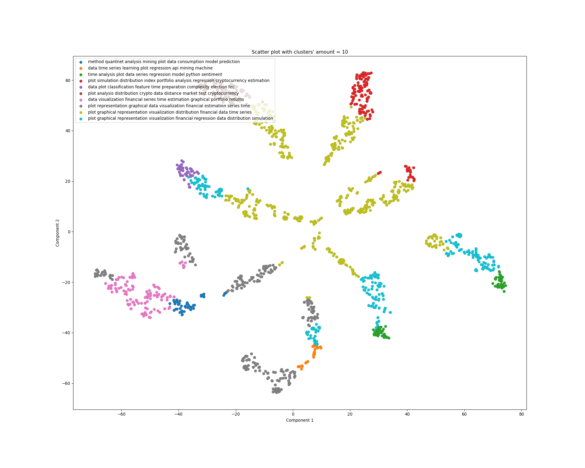
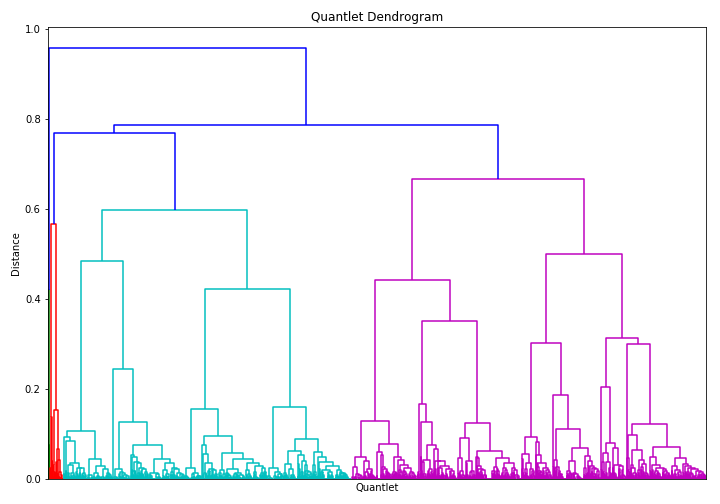
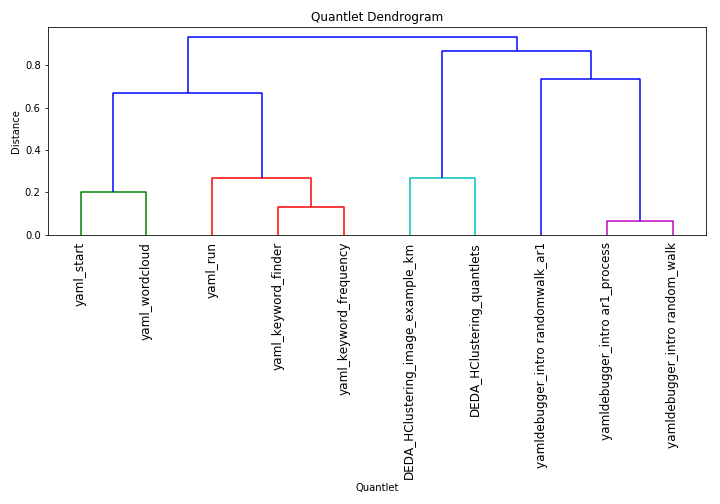
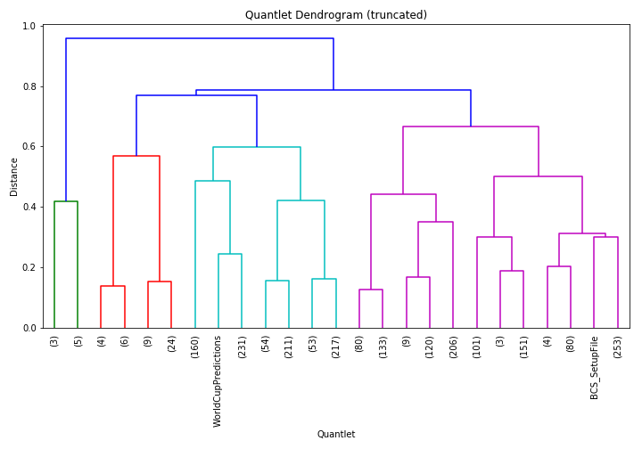

[](http://quantlet.de/)

## [](http://quantlet.de/) **DEDA_HClustering_quantlet** [](http://quantlet.de/)

```yaml

Name of QuantLet : DEDA_HClustering_quantlet

Published in : SFM class

Description : 'Hierarchical clustering on qunatlets'

Keywords : Quantlets, hierarchical, k-means, cluster analysis

Author : Elizaveta Zinovyeva

Submitted : Fri, January 13 2019 by Elizaveta Zinovyeva

```










### IPYNB Code

[DEDA_HClustering_quantlet.ipynb](DEDA_HClustering_quantlet.ipynb)


automatically created on 2019-01-29